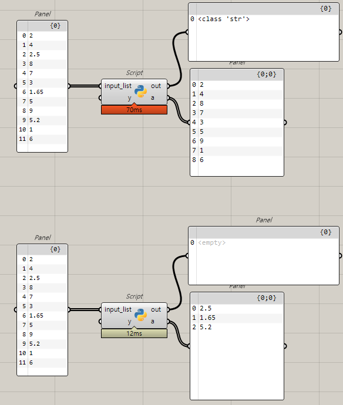
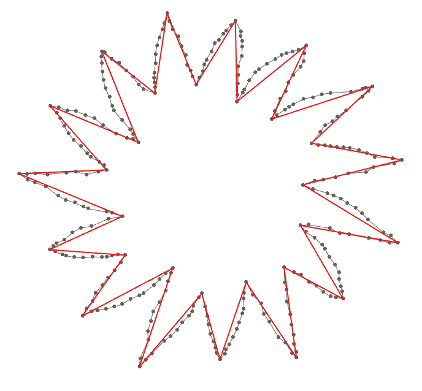
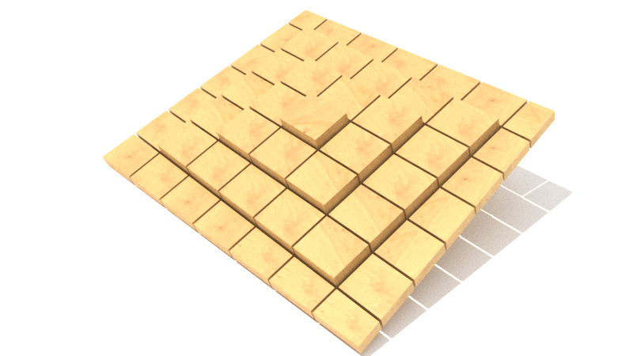
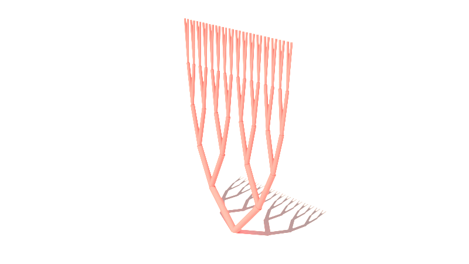
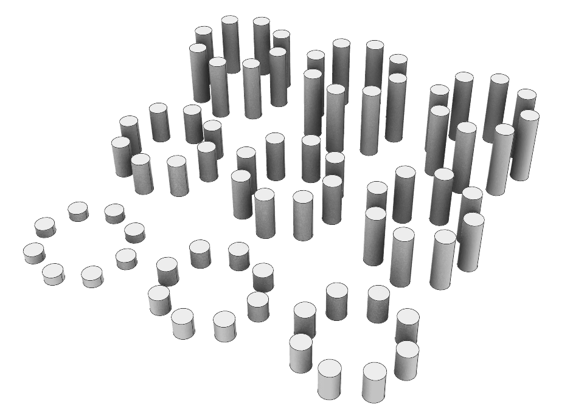
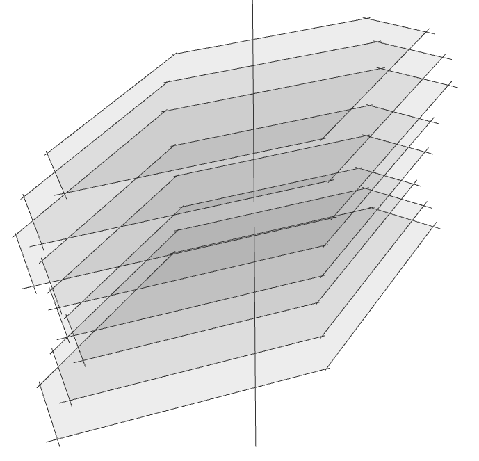
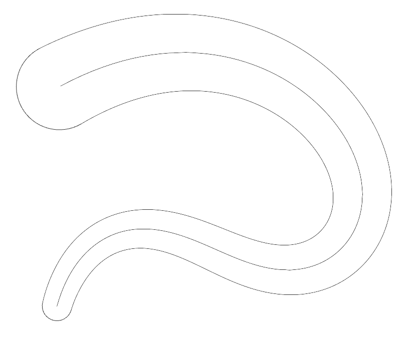
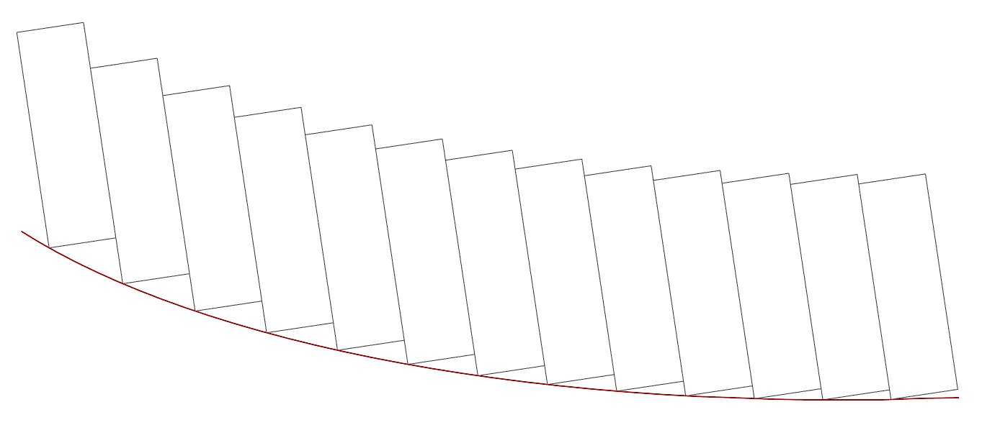
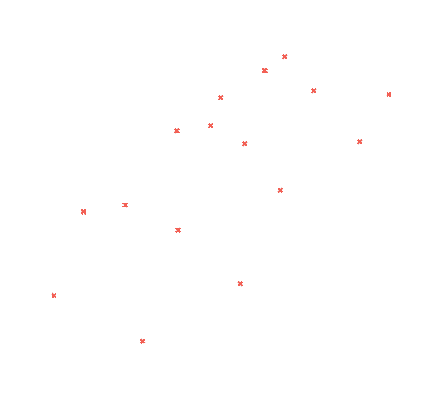
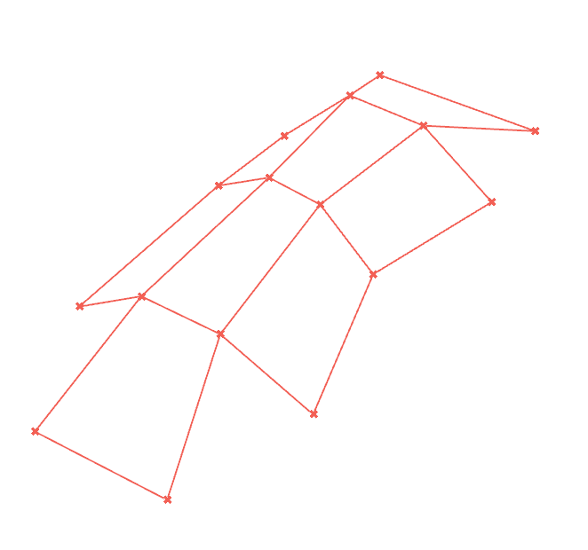

# Grasshopper_IDEA

### Goal : to practice grasshopper component and high skill 

---

### This page contains only images, and the corresponding implementation can be found in the **"grasshopper_skill"** folder.

---
## INDEX

* 01_Extracting decimal numbers from a list(python script)

* 02_How to use vector multiplication.

* 03_Extruding a quadrilateral polyline according to given conditions.

* 04_Creating a tree branch shape using the given line.

* 05_Data Tree - Shift Paths.

* 06_Converting the given line into a flat surface.

* 07_Variable offset curve.

* 08_Arranging rectangles along a curved path.

* 09_Creating a polyline by connecting points.
---
-------

> # 01_Extracting decimal numbers from a list(python script)

</img>

> # 02_How to use vector multiplication

</img>

> # 03_Extruding a quadrilateral polyline according to given conditions.

</img>

> # 04_Creating a tree branch shape using the given line

</img>

> # 05_Data Tree - Shift Paths

</img>

> # 06_Converting the given line into a flat surface

</img>

> # 07_Variable offset curve

</img>

> # 08_Arranging rectangles along a curved path

</img>

> # 09_Creating a polyline by connecting points.

</img>

</img>