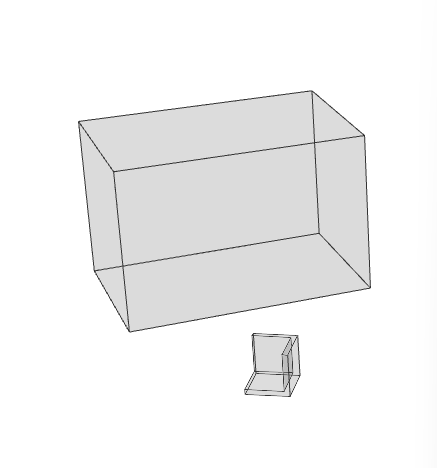
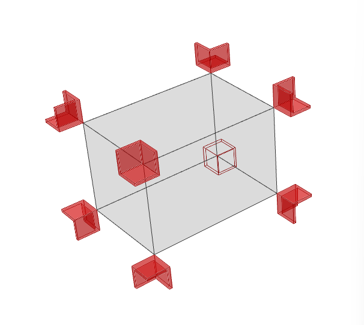

# Grasshopper_IDEA

### Goal : to practice grasshopper component and high skill 

---

### This page contains only images, and the corresponding implementation can be found in the **"grasshopper_skill"** folder.

---
## INDEX

* 01_Extracting decimal numbers from a list(python script)

* 02_How to use vector multiplication.

* 03_Extruding a quadrilateral polyline according to given conditions.

* 04_Creating a tree branch shape using the given line.

* 05_Data Tree - Shift Paths.

* 06_Converting the given line into a flat surface.

* 07_Variable offset curve.

* 08_Arranging rectangles along a curved path.

* 09_Creating a polyline by connecting points.

* 10_Arrange the given units at the edges.

* 11_automated_facade.

* 12_Cylindrical surface with brick pattern.

* 13_Grasshopper Parametric Light.

* 14_Kinetic facade Tutorial_(from adam youtube).

* 15_making a gable roof.

* 16_Divide surface.

* 17_line to surface.

* 18_Planar curve to surface.

* 19_Draw a perpendicular line from the longest side of a polygon.

* 20_Classify the given square cells into 2 branches.

* 21_Draw a zigzag polygon centered around a reference circle.

* 22_Convert a Mesh object to a Nurbs Surface.

* 23_Surface from points.

* 24_Wave curve box.

* 25_Extract Surface Edges to Create Mid-Surface.

* 26_Apply Fillet to Specific Edges in Brep.

* 27_Select Rectangular Cells within a Given Area.

* 28_Create Surfaces between Adjacent Polygons.

* 29_Inscribe a Circle in the Empty Space between Two Curves.

* 30_Create a Pipe Twisting Along an Arc Curve.

* 31_Create Hxagons Arranged Around a Circle.

---
-------

> # 01_Extracting decimal numbers from a list(python script)

</img>

> # 02_How to use vector multiplication

</img>

> # 03_Extruding a quadrilateral polyline according to given conditions.

</img>

> # 04_Creating a tree branch shape using the given line

</img>

> # 05_Data Tree - Shift Paths

</img>

> # 06_Converting the given line into a flat surface

</img>

> # 07_Variable offset curve

</img>

> # 08_Arranging rectangles along a curved path

</img>

> # 09_Creating a polyline by connecting points.

</img>

</img>

> # 10_Arrange the given units at the edges.

</img>

</img>

> # 11_automated_facade.

</img>

> # 12_Cylindrical surface with brick pattern.

</img>

</img>

</img>

</img>

> # 13_Grasshopper Parametric Light.

</img>

> # 14_Kinetic facade Tutorial_(from adam youtube).

</img>

> # 15_making a gable roof.

</img>

</img>

</img>

> # 16_Divide surface

</img>

</img>

</img>

> # 17_line to surface.

</img>

</img>

> # 18_Planar curve to surface.

</img>

</img>

> # 19_Draw a perpendicular line from the longest side of a polygon.

</img>

</img>

</img>

</img>

> # 20_Classify the given square cells into 2 branches.

</img>

</img>

</img>

</img>

> # 21_Draw a zigzag polygon centered around a reference circle.

</img>

</img>

> # 22_Convert a Mesh object to a Nurbs Surface.

</img>

</img>

</img>

> # 23_Surface from points.

</img>

</img>

> # 24_Wave curve box.

</img>

</img>

</img>

</img>

> # 25_Extract Surface Edges to Create Mid-Surface.

</img>

</img>

> # 26_Apply Fillet to Specific Edges in Brep.

</img>

</img>

</img>

> # 27_Select Rectangular Cells within a Given Area.

</img>

</img>

</img>

</img>

> # 28_Create Surfaces between Adjacent Polygons.

</img>

</img>

</img>

> # 29_Inscribe a Circle in the Empty Space between Two Curves.

</img>

</img>

</img>

> # 30_Create a Pipe Twisting Along an Arc Curve.

</img>

</img>

</img>

> # 31_Create Hxagons Arranged Around a Circle.